# Odiseo Email Service

<div align="center">


**Production-ready email microservice with queue management, retry logic, and SMTP integration.**

[Quick Start](#-quick-start) •
[API Reference](#-api-reference) •
[Configuration](#%EF%B8%8F-configuration) •
[Architecture](#-architecture)

</div>

---

## Overview

Odiseo Email Service is a robust, scalable email sending microservice designed for production environments. It provides:

- **Async Queue Processing** - Emails are queued and processed by background workers
- **Automatic Retries** - Exponential backoff with configurable retry attempts
- **SMTP Integration** - Compatible with Gmail, SendGrid, AWS SES, and any SMTP provider
- **RESTful API** - Simple JSON API for sending emails and monitoring queue status
- **PostgreSQL Storage** - Reliable persistence with atomic operations
- **Docker Ready** - Multi-stage build with health checks

---

## Features

| Feature | Description |
|---------|-------------|
| **Queue-based Processing** | Emails are stored in PostgreSQL and processed asynchronously |
| **Retry with Backoff** | Failed emails retry with exponential backoff (2^n × base_seconds) |
| **Concurrency Safe** | Uses `FOR UPDATE SKIP LOCKED` for horizontal scaling |
| **Template Support** | Jinja2 HTML email templates |
| **Health Monitoring** | `/health` endpoint for load balancer checks |
| **Structured Logging** | Rotating log files with configurable levels |

---

## Quick Start

### Prerequisites
- Docker and Docker Compose
- PostgreSQL (or use existing `mcp-postgres` container)
- SMTP credentials (Gmail, SendGrid, etc.)

### 1. Clone and Configure

```bash
# Clone repository
git clone https://github.com/odiseo/email-service.git
cd email-service

# Configure environment
cp .env.example .env
# Edit .env with your SMTP credentials
```

### 2. Start Services

```bash
# Start API and Worker
docker-compose up -d

# Check status
docker ps --filter "name=email-service"
```

### 3. Send a Test Email

```bash
curl -X POST http://localhost:8001/emails \
  -H "Content-Type: application/json" \
  -d '{
    "to": ["recipient@example.com"],
    "subject": "Hello from Odiseo",
    "body": "<h1>Welcome!</h1><p>Your email service is working.</p>"
  }'
```

### 4. Check Health

```bash
curl http://localhost:8001/health
```

---

## Architecture

### System Overview


### Request Flow

```mermaid
sequenceDiagram
    autonumber
    participant C as 🌐 Client
    participant A as ⚡ API
    participant DB as 🗄️ PostgreSQL
    participant W as ⚙️ Worker
    participant S as 📧 SMTP

    rect rgb(225, 245, 254)
        Note over C,A: Email Submission
        C->>+A: POST /emails
        A->>DB: INSERT (status=pending)
        A-->>-C: 202 Accepted
    end

    rect rgb(243, 229, 245)
        Note over W,S: Background Processing
        loop Every 10 seconds
            W->>DB: SELECT FOR UPDATE SKIP LOCKED
            DB-->>W: Pending emails
            W->>DB: UPDATE status=processing
            W->>+S: Send via SMTP
            S-->>-W: Success/Failure
            alt Success
                W->>DB: UPDATE status=sent
            else Failure (retries left)
                W->>DB: UPDATE status=scheduled
            else Max retries exceeded
                W->>DB: UPDATE status=failed
            end
        end
    end
```



### Email State Machine


### Container Architecture

```mermaid
flowchart LR
    subgraph Docker["🐳 Docker Network"]
        direction TB

        subgraph Services["Email Service Containers"]
            API["📡 email-service-api<br/>Port: 8001"]
            WORKER["⚙️ email-service-worker<br/>Background Process"]
        end

        subgraph External["External Services"]
            PG["🐘 mcp-postgres<br/>Port: 5432"]
        end
    end

    subgraph Internet["☁️ Internet"]
        SMTP["📧 SMTP Server"]
    end

    API <--> PG
    WORKER <--> PG
    WORKER --> SMTP

    style API fill:#4caf50,stroke:#2e7d32,color:#fff
    style WORKER fill:#2196f3,stroke:#1565c0,color:#fff
    style PG fill:#ff9800,stroke:#e65100,color:#fff
    style SMTP fill:#e91e63,stroke:#ad1457,color:#fff
```



---

## API Reference

### POST /emails

Send an email (queued for async delivery).

**Request:**
```json
{
  "to": ["user@example.com"],
  "subject": "Hello World",
  "body": "<h1>Welcome!</h1>",
  "client_message_id": "optional-uuid",
  "template_id": null,
  "template_vars": {}
}
```

**Response (202 Accepted):**
```json
{
  "status": "accepted",
  "queued": true,
  "message_id": "5a377f3a-abeb-4e60-a59e-2a706e6021f8",
  "detail": "Email stored in queue",
  "timestamp": "2025-12-02T05:07:15.918469"
}
```

---

### GET /queue/status

Get email queue statistics.

**Response:**
```json
{
  "pending": 0,
  "scheduled": 0,
  "processing": 0,
  "sent": 23,
  "failed": 0,
  "timestamp": "2025-12-02T05:07:56.869278"
}
```

---

### GET /health

Check service health.

**Response:**
```json
{
  "status": "ok",
  "db": "ok",
  "email_provider": "ok",
  "version": "1.0.0",
  "timestamp": "2025-12-02T05:06:28.463917"
}
```

---

## Configuration

### Environment Variables

| Variable | Default | Description |
|----------|---------|-------------|
| **Service** |||
| `SERVICE_NAME` | email-service | Service identifier |
| `SERVICE_VERSION` | 1.0.0 | Version string |
| `API_PORT` | 8001 | API server port |
| **Database** |||
| `DATABASE_URL` | - | PostgreSQL connection string |
| `SCHEMA_NAME` | test | Database schema name |
| **SMTP** |||
| `SMTP_HOST` | smtp.gmail.com | SMTP server hostname |
| `SMTP_PORT` | 587 | SMTP server port |
| `SMTP_USER` | - | SMTP username |
| `SMTP_PASSWORD` | - | SMTP password |
| `SMTP_FROM_EMAIL` | noreply@odiseo.io | Sender email |
| `SMTP_FROM_NAME` | Odiseo | Sender display name |
| `SMTP_USE_TLS` | true | Enable TLS |
| **Worker** |||
| `EMAIL_WORKER_POLL_INTERVAL` | 10 | Queue poll interval (seconds) |
| `EMAIL_WORKER_BATCH_SIZE` | 50 | Max emails per batch |
| `EMAIL_RETRY_MAX_ATTEMPTS` | 3 | Maximum retry attempts |
| `EMAIL_RETRY_BACKOFF_SECONDS` | 300 | Initial backoff (seconds) |
| **Logging** |||
| `LOG_LEVEL` | INFO | Log level |
| `LOG_TO_FILE` | true | Enable file logging |
| `LOG_DIR` | ./logs | Log directory |

### Gmail Configuration

1. Enable 2-Factor Authentication on your Google account
2. Generate an App Password at https://myaccount.google.com/apppasswords
3. Configure `.env`:

```bash
SMTP_HOST=smtp.gmail.com
SMTP_PORT=587
SMTP_USER=your-email@gmail.com
SMTP_PASSWORD=your-app-password
SMTP_FROM_EMAIL=your-email@gmail.com
SMTP_FROM_NAME=Odiseo
SMTP_USE_TLS=true
```

---

## Project Structure

```
email-service/
├── api/
│   ├── main.py              # FastAPI endpoints
│   └── schemas.py           # Pydantic models
├── clients/
│   └── smtp.py              # SMTP client
├── config/
│   └── settings.py          # Configuration
├── core/
│   ├── exceptions.py        # Custom exceptions
│   └── logger.py            # Logging setup
├── database/
│   └── queue.py             # Queue manager
├── models/
│   ├── email.py             # Email models
│   └── smtp_config.py       # SMTP config model
├── templates/
│   ├── renderer.py          # Jinja2 renderer
│   └── *.html               # Email templates
├── worker/
│   ├── __main__.py          # Entry point
│   └── processor.py         # Email worker
├── sql/
│   └── init.sql             # Database schema
├── docker-compose.yml
├── Dockerfile
├── requirements.txt
└── .env.example
```

---

## Docker Commands

```bash
# Start services
docker-compose up -d

# View logs
docker logs -f email-service-api
docker logs -f email-service-worker

# Stop services
docker-compose down

# Rebuild after changes
docker-compose up -d --build

# Check container status
docker ps --filter "name=email-service"
```

---

## Database Schema

The service uses a PostgreSQL queue table with the following key fields:

```sql
CREATE TABLE test.email_queue (
    id BIGSERIAL PRIMARY KEY,
    recipient_email TEXT,
    subject TEXT,
    body_html TEXT,
    status TEXT DEFAULT 'pending',  -- pending|scheduled|processing|sent|failed
    retry_count INT DEFAULT 0,
    max_retries INT DEFAULT 3,
    created_at TIMESTAMPTZ DEFAULT now(),
    sent_at TIMESTAMPTZ,
    last_error TEXT
);
```

### Concurrency

The worker uses `FOR UPDATE SKIP LOCKED` for safe concurrent processing:

```sql
SELECT * FROM email_queue
WHERE status IN ('pending', 'scheduled')
ORDER BY priority, created_at
LIMIT 50
FOR UPDATE SKIP LOCKED;
```

---

## Retry Logic


**Backoff Formula:** `backoff_seconds × 2^retry_count`

| Retry | Wait Time (base=300s) |
|-------|----------------------|
| 1st   | 5 minutes |
| 2nd   | 10 minutes |
| 3rd   | 20 minutes |

---

## Monitoring

### Health Check

```bash
# Check if service is healthy
curl -f http://localhost:8001/health || echo "Service unhealthy"
```

### Queue Status

```bash
# Monitor queue
watch -n 5 'curl -s http://localhost:8001/queue/status | jq'
```

### Logs

```bash
# API logs
docker logs -f email-service-api

# Worker logs
docker logs -f email-service-worker

# Log files (if LOG_TO_FILE=true)
tail -f logs/email_service.log
```

---

## Troubleshooting

### Common Issues

| Issue | Solution |
|-------|----------|
| Port 8001 in use | Change `API_PORT` in `.env` |
| SMTP connection failed | Verify credentials and enable App Passwords for Gmail |
| Database connection error | Ensure PostgreSQL is running and accessible |
| Emails stuck in pending | Check worker logs: `docker logs email-service-worker` |

### Debug Mode

```bash
# Run with debug logging
LOG_LEVEL=DEBUG docker-compose up
```

---

## Test Scenarios

This section provides practical test scenarios to validate the email service functionality.

### Scenario 1: Invalid Email Address

**Objective:** Verify API validation rejects invalid email formats.

**Step 1: Send request with invalid email**

```bash
curl -X POST http://localhost:8001/emails \
  -H "Content-Type: application/json" \
  -d '{
    "to": ["tvbox.com"],
    "subject": "Test Invalid Email",
    "body": "<h1>Test</h1><p>This should fail validation.</p>"
  }'
```

**Response (422 Unprocessable Entity):**

```json
{
  "detail": [
    {
      "type": "value_error",
      "loc": ["body", "to", 0],
      "msg": "value is not a valid email address: An email address must have an @-sign.",
      "input": "tvbox.com",
      "ctx": {
        "reason": "An email address must have an @-sign."
      }
    }
  ]
}
```

**Result:** ❌ Request rejected - Email validation working correctly.

---

### Scenario 2: Valid Email Delivery

**Objective:** Verify successful email delivery to a valid recipient.

**Step 1: Send email request**

```bash
curl -X POST http://localhost:8001/emails \
  -H "Content-Type: application/json" \
  -d '{
    "to": ["recipient@example.com"],
    "subject": "Test Scenario 2 - Valid Email",
    "body": "<h1>Hello!</h1><p>This is a test email from Odiseo Email Service.</p>"
  }'
```

**Response (202 Accepted):**

```json
{
  "status": "accepted",
  "queued": true,
  "message_id": "8e9dd8d6-8f0f-47ec-9781-8da0e6184340",
  "detail": "Email stored in queue",
  "timestamp": "2025-12-02T05:43:34.633201"
}
```

**Step 2: Check queue status (after ~10 seconds)**

```bash
curl http://localhost:8001/queue/status
```

**Response:**

```json
{
  "pending": 0,
  "scheduled": 0,
  "processing": 0,
  "sent": 24,
  "failed": 0,
  "timestamp": "2025-12-02T05:43:49.020708"
}
```

**Step 3: Verify in worker logs**

```bash
docker logs email-service-worker 2>&1 | tail -5
```

```
2025-12-02 05:43:38 - INFO - Starting: #24 | process_email | →recipient@example.com (type=transactional)
2025-12-02 05:43:38 - INFO - Email #24 status updated to processing
2025-12-02 05:43:42 - INFO - Email sent to recipient@example.com - Subject: Test Scenario 2...
2025-12-02 05:43:42 - INFO - Email #24 status updated to sent
2025-12-02 05:43:42 - INFO - COMPLETED: #24 | process_email | →recipient@example.com (type=transactional)
```

**Result:** ✅ Email delivered successfully.

---

### Scenario 3: Email with Template (OTP Verification)

**Objective:** Verify template rendering with dynamic variables.

**Step 1: Send email with template**

```bash
curl -X POST http://localhost:8001/emails \
  -H "Content-Type: application/json" \
  -d '{
    "to": ["recipient@example.com"],
    "subject": "Verify Your Email - OTP Code",
    "body": "fallback body",
    "template_id": "otp_verification",
    "template_vars": {
      "recipient_name": "John Doe",
      "otp_code": "123456",
      "company_name": "Odiseo"
    }
  }'
```

**Response (202 Accepted):**

```json
{
  "status": "accepted",
  "queued": true,
  "message_id": "167285e5-bb58-4e79-8f24-538e507552d3",
  "detail": "Email stored in queue",
  "timestamp": "2025-12-02T05:45:48.642756"
}
```

**Step 2: Check worker logs**

```bash
docker logs email-service-worker 2>&1 | grep "otp_verification"
```

```
2025-12-02 05:45:51 - INFO - Starting: #25 | process_email | →recipient@example.com (type=otp_verification)
2025-12-02 05:45:53 - INFO - COMPLETED: #25 | process_email | →recipient@example.com (type=otp_verification)
```

**Available Templates:**

| Template ID | Description | Required Variables |
|-------------|-------------|-------------------|
| `otp_verification` | OTP verification code | `recipient_name`, `otp_code` |
| `booking_created` | Booking confirmation | `customer_name`, `service_type`, `booking_date`, `booking_time` |
| `booking_cancelled` | Cancellation notice | `customer_name`, `service_type`, `booking_date` |
| `booking_rescheduled` | Reschedule notice | `customer_name`, `old_date`, `new_date` |
| `reminder_24h` | 24-hour reminder | `customer_name`, `service_type`, `booking_date`, `booking_time` |
| `reminder_1h` | 1-hour reminder | `customer_name`, `service_type`, `booking_date`, `booking_time` |

**Result:** ✅ Template rendered and email delivered.

---

### Scenario 4: Error Handling and Retry Flow

**Objective:** Verify retry mechanism with exponential backoff.

#### State Transitions

```mermaid
stateDiagram-v2
    direction LR

    [*] --> pending: 1. Email Created
    pending --> processing: 2. Worker Picks Up
    processing --> scheduled: 3. SMTP Error (retry)
    scheduled --> processing: 4. Retry After Backoff
    processing --> sent: 5. Success

    note right of scheduled: retry_count: 1
    note right of processing: Attempt 2/3
```

#### Step 1: Initial Email (pending → processing → error → scheduled)

**Worker attempts delivery:**
```
2025-12-02 05:46:20 - INFO - Starting: #26 | process_email | →user@example.com
2025-12-02 05:46:20 - INFO - Email #26 status updated to processing
2025-12-02 05:46:22 - ERROR - FAILED: #26 | SMTP connection timeout after 30s
2025-12-02 05:46:22 - WARNING - SCHEDULED RETRY: #26 | attempt 1/3 | backoff_secs=300
```

**Database state after failure:**
```sql
SELECT id, status, retry_count, last_error, next_retry_at
FROM email_queue WHERE id = 26;
```

```
 id | status    | retry_count | last_error                              | next_retry_at
----+-----------+-------------+-----------------------------------------+------------------------
 26 | scheduled |           1 | SMTP connection timeout after 30s       | 2025-12-02 05:51:22+00
```

#### Step 2: Retry After Backoff (scheduled → processing → sent)

**Worker polls and finds scheduled email ready:**
```
2025-12-02 05:51:30 - INFO - Retrieved 1 pending emails
2025-12-02 05:51:30 - INFO - Starting: #26 | process_email | →user@example.com
2025-12-02 05:51:30 - INFO - Email #26 status updated to processing
2025-12-02 05:51:33 - INFO - Email sent to user@example.com - Subject: Test...
2025-12-02 05:51:33 - INFO - Email #26 status updated to sent
2025-12-02 05:51:33 - INFO - COMPLETED: #26 | process_email | →user@example.com
```

**Database state after success:**
```sql
SELECT id, status, retry_count, sent_at FROM email_queue WHERE id = 26;
```

```
 id | status | retry_count | sent_at
----+--------+-------------+------------------------------
 26 | sent   |           1 | 2025-12-02 05:51:33.180000+00
```

**Result:** ✅ Email delivered on retry attempt.

---

### Scenario 5: Permanent Failure (Max Retries Exceeded)

**Objective:** Verify emails are marked as failed after max retries.

#### State Transitions

```mermaid
stateDiagram-v2
    direction LR

    [*] --> pending: 1. Email Created
    pending --> processing: 2. Attempt 1
    processing --> scheduled: 3. Error → Retry
    scheduled --> processing: 4. Attempt 2
    processing --> scheduled: 5. Error → Retry
    scheduled --> processing: 6. Attempt 3 (final)
    processing --> failed: 7. Max Retries Exceeded

    note right of failed: retry_count: 3/3
```

#### Database State Progression

| Step | Status | retry_count | Event |
|------|--------|-------------|-------|
| 1 | `pending` | 0 | Email created |
| 2 | `processing` | 0 | Worker picks up |
| 3 | `scheduled` | 1 | SMTP error, retry scheduled |
| 4 | `processing` | 1 | Retry attempt 2 |
| 5 | `scheduled` | 2 | SMTP error, retry scheduled |
| 6 | `processing` | 2 | Retry attempt 3 (final) |
| 7 | `failed` | 3 | Max retries exceeded |

#### Final State

```sql
SELECT id, status, retry_count, max_retries, last_error
FROM email_queue WHERE id = 27;
```

```
 id | status | retry_count | max_retries | last_error
----+--------+-------------+-------------+----------------------------------------------------------
 27 | failed |           3 |           3 | SMTP error: Max retries exceeded. Connection refused.
```

**Worker log:**
```
2025-12-02 05:50:15 - CRITICAL - PERMANENTLY FAILED: #27 | max_retries_exceeded=3 | error=Connection refused
```

**Queue status reflects failed count:**
```json
{
  "pending": 0,
  "scheduled": 0,
  "processing": 0,
  "sent": 26,
  "failed": 1,
  "timestamp": "2025-12-02T05:48:15.821033"
}
```

**Result:** ❌ Email permanently failed (as expected after max retries).

---

### Scenario 6: Queue Status Monitoring

**Objective:** Monitor queue health during bulk operations.

**Step 1: Check queue status**

```bash
curl http://localhost:8001/queue/status
```

**Response:**

```json
{
  "pending": 0,
  "scheduled": 0,
  "processing": 0,
  "sent": 26,
  "failed": 1,
  "timestamp": "2025-12-02T05:48:15.821033"
}
```

**Status Definitions:**

| Status | Description |
|--------|-------------|
| `pending` | New emails waiting for first delivery attempt |
| `scheduled` | Failed emails waiting for retry (backoff period) |
| `processing` | Currently being sent via SMTP |
| `sent` | Successfully delivered |
| `failed` | Permanently failed (max retries exceeded) |

**Step 2: Monitor in real-time**

```bash
# Watch queue status every 5 seconds
watch -n 5 'curl -s http://localhost:8001/queue/status | python3 -m json.tool'
```

**Result:** ✅ Queue monitoring operational.

---

### Scenario 7: Health Check Validation

**Objective:** Verify service health endpoint for load balancer integration.

**Step 1: Check health**

```bash
curl http://localhost:8001/health
```

**Response (200 OK - Healthy):**

```json
{
  "status": "ok",
  "db": "ok",
  "email_provider": "ok",
  "version": "1.0.0",
  "timestamp": "2025-12-02T05:50:00.000000"
}
```

**Response (503 Service Unavailable - Degraded):**

```json
{
  "status": "degraded",
  "db": "error",
  "email_provider": "ok",
  "version": "1.0.0",
  "timestamp": "2025-12-02T05:50:00.000000"
}
```

**Health Check Script:**

```bash
#!/bin/bash
# health_check.sh - Use with load balancers or monitoring

response=$(curl -sf http://localhost:8001/health)
if [ $? -eq 0 ]; then
    status=$(echo $response | grep -o '"status":"[^"]*"' | cut -d'"' -f4)
    if [ "$status" = "ok" ]; then
        echo "Service healthy"
        exit 0
    fi
fi
echo "Service unhealthy"
exit 1
```

**Result:** ✅ Health check operational for production monitoring.

---

## Contributing

1. Fork the repository
2. Create a feature branch (`git checkout -b feature/amazing-feature`)
3. Commit changes (`git commit -m 'Add amazing feature'`)
4. Push to branch (`git push origin feature/amazing-feature`)
5. Open a Pull Request

---

## License

This project is licensed under the MIT License.

```
MIT License

Copyright (c) 2025 Odiseo

Permission is hereby granted, free of charge, to any person obtaining a copy
of this software and associated documentation files (the "Software"), to deal
in the Software without restriction, including without limitation the rights
to use, copy, modify, merge, publish, distribute, sublicense, and/or sell
copies of the Software.
```

---

<div align="center">

**Odiseo Email Service** • Built with FastAPI & PostgreSQL

[Report Bug](https://github.com/odiseo/email-service/issues) •
[Request Feature](https://github.com/odiseo/email-service/issues)

</div>
