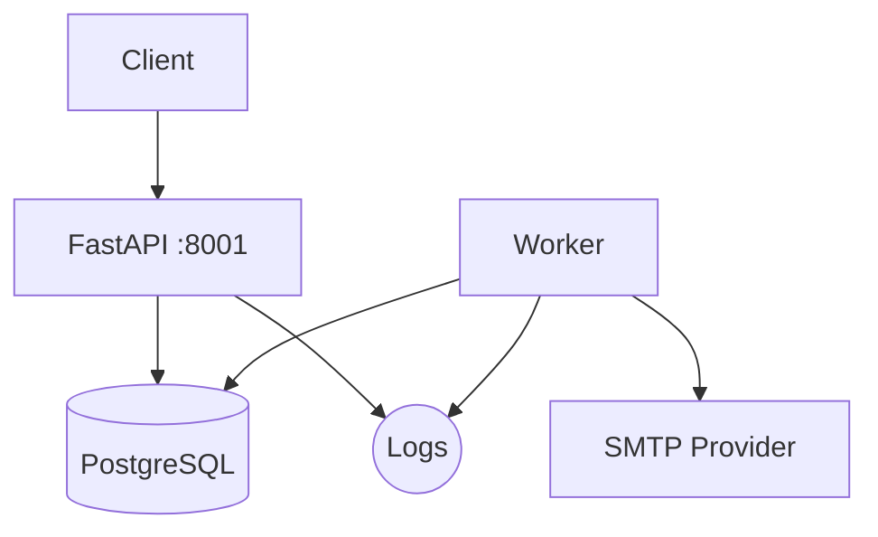
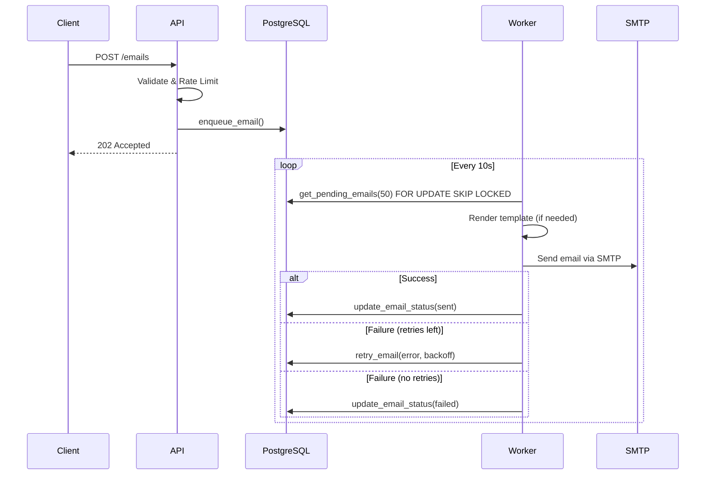
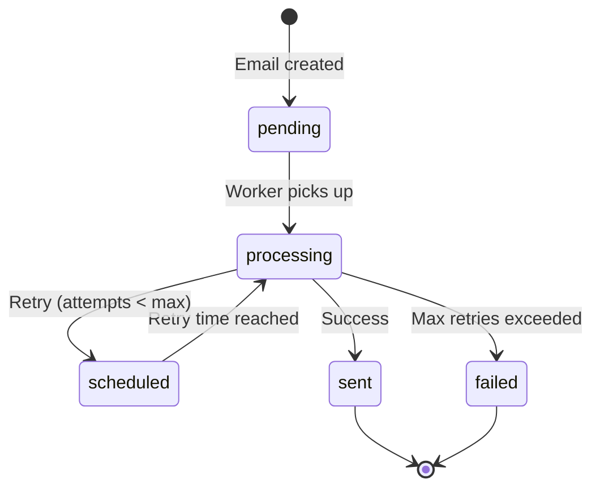
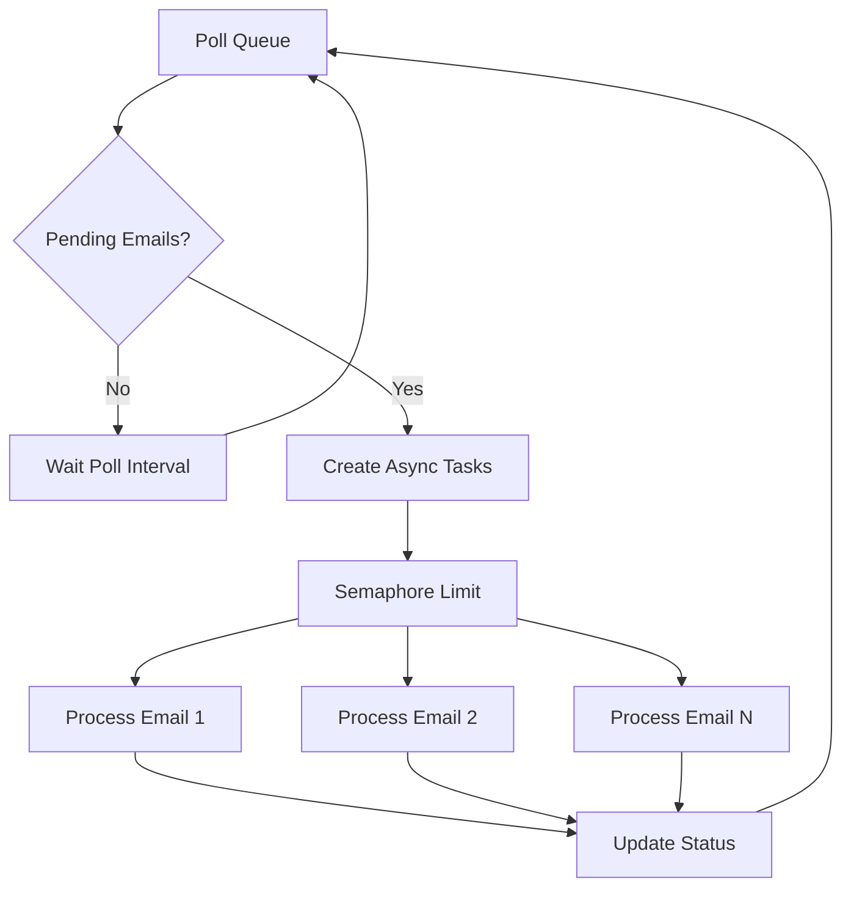

# REQ-1: Email Microservice Specification

**Author:** Odiseo
**Version:** 2.0.0
**Status:** Implemented
**Last Updated:** 2025-12-05

---

## Table of Contents
1. [Overview](#1-overview)
2. [Functional Requirements](#2-functional-requirements)
3. [Email Queue Table Specification](#3-email-queue-table-specification)
4. [Concurrency Handling](#4-concurrency-handling)
5. [Retry Logic](#5-retry-logic)
6. [Background Worker](#6-background-worker)
7. [API Specifications](#7-api-specifications)
8. [Security Features](#8-security-features)
9. [Template System](#9-template-system)
10. [Logging System](#10-logging-system)
11. [Exception Handling](#11-exception-handling)
12. [Data Models](#12-data-models)
13. [Docker Environment](#13-docker-environment)
14. [Environment Variables](#14-environment-variables)
15. [Project Structure](#15-project-structure)
16. [Dependencies](#16-dependencies)
17. [Database Functions](#17-database-functions)
18. [Mermaid Diagrams](#18-mermaid-diagrams)
19. [Requirements Compliance](#19-requirements-compliance)
20. [Deployment](#20-deployment)
21. [Test Scenarios](#21-test-scenarios)

---

## 1. Overview

This document defines the complete functional and technical specification for a production-ready **Email Sending Microservice**. The service exposes endpoints to send emails, check queue status, and validate service health. All emails—successful or failed—are stored in a PostgreSQL queue table and retried by a background worker.

### 1.1 Key Features
- **Async Queue Processing** - Emails are queued and processed by background workers
- **Automatic Retries** - Exponential backoff with configurable retry attempts
- **SMTP Integration** - Compatible with Gmail, SendGrid, AWS SES, and any SMTP provider
- **RESTful API** - Simple JSON API for sending emails and monitoring queue status
- **PostgreSQL Storage** - Reliable persistence with atomic operations
- **Docker Ready** - Multi-stage build with health checks
- **Security** - API key authentication and rate limiting
- **Template Support** - Jinja2 HTML email templates with fallback text generation

### 1.2 Architecture Principles
- Modular architecture, small files (<280 lines)
- Pydantic v2 validation
- Python 3.11+ type hints
- Structured logging with rotation
- Robust error handling with custom exceptions
- No hardcoded values (all configurable via environment)
- Up-to-date dependencies
- Clean, PEP8-compliant code

---

## 2. Functional Requirements

### 2.1 Endpoints
| Endpoint | Method | Description | Auth Required |
|----------|--------|-------------|---------------|
| `/emails` | POST | Queue an email for delivery | Yes (if API_KEY set) |
| `/queue/status` | GET | Returns queue statistics by status | Yes (if API_KEY set) |
| `/health` | GET | Service health check | No |

### 2.2 Endpoint Behaviors
Every endpoint must:
- Return structured JSON responses
- Include timestamps in responses
- Log every operation
- Handle errors gracefully with sanitized messages
- Respect rate limits (except `/health`)

---

## 3. Email Queue Table Specification

### 3.1 Status Values
```python
class EmailStatus(str, Enum):
    PENDING = "pending"      # Waiting in queue for processing
    SCHEDULED = "scheduled"  # Waiting for scheduled_for timestamp
    PROCESSING = "processing"  # Currently being sent via SMTP
    SENT = "sent"           # Successfully delivered
    FAILED = "failed"       # Delivery failed after max retries
```

### 3.2 Email Types
```python
class EmailType(str, Enum):
    TRANSACTIONAL = "transactional"
    BOOKING_CREATED = "booking_created"
    BOOKING_CANCELLED = "booking_cancelled"
    BOOKING_RESCHEDULED = "booking_rescheduled"
    REMINDER_24H = "reminder_24h"
    REMINDER_1H = "reminder_1h"
    REMINDER_CUSTOM = "reminder_custom"
    OTP_VERIFICATION = "otp_verification"
```

### 3.3 SQL Schema
```sql
CREATE SCHEMA IF NOT EXISTS test;

CREATE TABLE IF NOT EXISTS test.email_queue (
    id BIGSERIAL PRIMARY KEY,
    client_message_id TEXT,

    -- Recipients
    to_addresses TEXT[] NOT NULL,
    cc_addresses TEXT[],
    bcc_addresses TEXT[],

    -- Content
    subject TEXT,
    body TEXT,
    template_id TEXT,
    template_vars JSONB,
    metadata JSONB,

    -- Email type and recipient info
    email_type TEXT NOT NULL DEFAULT 'transactional',
    recipient_email TEXT,
    recipient_name TEXT,
    body_html TEXT,
    body_text TEXT,
    booking_id BIGINT,
    template_context JSONB,
    priority INT NOT NULL DEFAULT 5,

    -- Status tracking
    status TEXT NOT NULL DEFAULT 'pending',
    attempts INT NOT NULL DEFAULT 0,
    max_attempts INT NOT NULL DEFAULT 5,
    retry_count INT NOT NULL DEFAULT 0,
    max_retries INT NOT NULL DEFAULT 3,

    -- Timestamps
    created_at TIMESTAMPTZ DEFAULT now(),
    updated_at TIMESTAMPTZ DEFAULT now(),
    last_attempt_at TIMESTAMPTZ,
    next_attempt_at TIMESTAMPTZ,
    scheduled_for TIMESTAMPTZ DEFAULT now(),
    sent_at TIMESTAMPTZ,
    next_retry_at TIMESTAMPTZ,

    -- Error tracking
    last_error TEXT,
    provider_response JSONB
);

-- Indexes for Performance
CREATE INDEX idx_email_queue_status ON test.email_queue (status);
CREATE INDEX idx_email_queue_next_attempt ON test.email_queue (next_attempt_at);
CREATE INDEX idx_email_queue_scheduled_for ON test.email_queue (scheduled_for);
CREATE INDEX idx_email_queue_priority ON test.email_queue (priority);
```

---

## 4. Concurrency Handling

The worker ensures safe transitions between states using PostgreSQL locking mechanisms.

### 4.1 State Transitions
- `pending` → `processing`
- `scheduled` → `processing`
- `processing` → (`sent` | `scheduled` | `failed`)

### 4.2 Concurrency Techniques
- `SELECT ... FOR UPDATE SKIP LOCKED` for horizontal-scalable workers
- Atomic status transitions via stored procedures
- Batch pulling of tasks (configurable batch size)
- Priority-based processing
- Connection pooling with automatic validation
- Retry decorator for transient database failures

### 4.3 Worker Concurrency
The worker supports concurrent email processing with configurable parallelism:
- `EMAIL_WORKER_CONCURRENCY` controls max parallel email sends (default: 5)
- Uses asyncio Semaphore for concurrency limiting
- Thread-safe SMTP connection with automatic refresh

---

## 5. Retry Logic

### 5.1 Exponential Backoff Formula
```
next_retry_at = now() + (backoff_seconds × 2^retry_count)
```

### 5.2 Retry Configuration
| Variable | Default | Description |
|----------|---------|-------------|
| `EMAIL_RETRY_MAX_ATTEMPTS` | 3 | Maximum retry attempts (1-10) |
| `EMAIL_RETRY_BACKOFF_SECONDS` | 300 | Initial backoff duration (60-86400 seconds) |

### 5.3 Retry Schedule Example
| Retry | Wait Time (base=300s) |
|-------|----------------------|
| 1st   | 5 minutes |
| 2nd   | 10 minutes |
| 3rd   | 20 minutes |

### 5.4 Retry Behavior
- Retry only if `retry_count < max_retries`
- On success: status → `sent`, `sent_at` timestamp recorded
- On retry: status → `scheduled`, increment `retry_count`, set `next_retry_at`
- On final failure: status → `failed`, store error message

---

## 6. Background Worker

### 6.1 Worker Configuration
| Variable | Default | Range | Description |
|----------|---------|-------|-------------|
| `EMAIL_WORKER_POLL_INTERVAL` | 10 | 1-3600 | Seconds between queue polls |
| `EMAIL_WORKER_BATCH_SIZE` | 50 | 1-1000 | Max emails per batch |
| `EMAIL_WORKER_CONCURRENCY` | 5 | 1-20 | Max concurrent email sends |
| `EMAIL_RETRY_MAX_ATTEMPTS` | 3 | 1-10 | Maximum retry attempts |
| `EMAIL_RETRY_BACKOFF_SECONDS` | 300 | 60-86400 | Initial backoff duration |

### 6.2 Worker Behavior
1. Poll queue for `pending` or `scheduled` emails where `scheduled_for <= now()`
2. Atomically move to `processing` with `FOR UPDATE SKIP LOCKED`
3. Process emails concurrently with semaphore-limited parallelism
4. Render template if `template_context` provided, otherwise use `body_html`
5. Attempt to send email via SMTP provider
6. Update status: `sent` on success, `scheduled` for retry, `failed` on max retries
7. Log every step with structured logging
8. Print statistics on shutdown

### 6.3 Worker Statistics
On shutdown, the worker prints:
- Total attempts
- Successfully sent count
- Scheduled for retry count
- Permanently failed count
- Success rate percentage

### 6.4 Graceful Shutdown
- Handles SIGTERM and SIGINT signals
- Completes current batch before stopping
- Closes SMTP client before queue manager
- Releases all database connections

---

## 7. API Specifications

### 7.1 POST `/emails`

**Description:** Queue an email for delivery.

**Security:**
- Rate limited (60 requests/minute, 10 requests/second per client)
- Requires API key if `API_KEY` is configured

**Request Body:**
```json
{
  "client_message_id": "optional-uuid",
  "to": ["user@example.com"],
  "cc": ["cc@example.com"],
  "bcc": ["bcc@example.com"],
  "subject": "Hello World",
  "body": "<h1>Welcome!</h1>",
  "template_id": "otp_verification",
  "template_vars": {
    "recipient_name": "John Doe",
    "otp_code": "123456"
  },
  "metadata": {"custom_key": "value"}
}
```

**Request Fields:**
| Field | Type | Required | Description |
|-------|------|----------|-------------|
| `to` | array[EmailStr] | Yes | List of recipient emails (min 1) |
| `subject` | string | Yes | Subject line (1-998 chars) |
| `body` | string | Yes | HTML email body (min 1 char) |
| `client_message_id` | string | No | Client-provided tracking ID |
| `cc` | array[EmailStr] | No | CC recipients |
| `bcc` | array[EmailStr] | No | BCC recipients |
| `template_id` | string | No | Template ID for dynamic content |
| `template_vars` | object | No | Variables for template rendering |
| `metadata` | object | No | Custom metadata for tracking |

**Response (202 Accepted):**
```json
{
  "status": "accepted",
  "queued": true,
  "message_id": "5a377f3a-abeb-4e60-a59e-2a706e6021f8",
  "detail": "Email stored in queue",
  "timestamp": "2025-12-02T05:07:15.918469"
}
```

**Error Responses:**
| Code | Description |
|------|-------------|
| 400 | Invalid request body |
| 401 | API key required/invalid |
| 422 | Validation error (invalid email, etc.) |
| 429 | Rate limit exceeded |
| 500 | Server error |

---

### 7.2 GET `/queue/status`

**Description:** Get email queue statistics by status.

**Security:**
- Requires API key if `API_KEY` is configured

**Response (200 OK):**
```json
{
  "pending": 0,
  "scheduled": 0,
  "processing": 0,
  "sent": 23,
  "failed": 0,
  "timestamp": "2025-12-02T05:07:56.869278"
}
```

**Status Definitions:**
| Status | Description |
|--------|-------------|
| `pending` | New emails waiting for first delivery attempt |
| `scheduled` | Failed emails waiting for retry (backoff period) |
| `processing` | Currently being sent via SMTP |
| `sent` | Successfully delivered |
| `failed` | Permanently failed (max retries exceeded) |

---

### 7.3 GET `/health`

**Description:** Check service health. No authentication required.

**Response (200 OK - Healthy):**
```json
{
  "status": "ok",
  "db": "ok",
  "email_provider": "ok",
  "version": "2.0.0",
  "timestamp": "2025-12-02T05:06:28.463917"
}
```

**Response (503 Service Unavailable - Degraded):**
```json
{
  "status": "degraded",
  "db": "error",
  "email_provider": "ok",
  "version": "2.0.0",
  "timestamp": "2025-12-02T05:06:28.463917"
}
```

**Health Status Values:**
| Field | Values | Description |
|-------|--------|-------------|
| `status` | ok, degraded | Overall service status |
| `db` | ok, error | Database connectivity |
| `email_provider` | ok, not_configured, error | SMTP configuration status |

---

## 8. Security Features

### 8.1 API Key Authentication

**Configuration:**
- Set `API_KEY` environment variable to enable
- Leave empty to disable authentication

**Usage:**
```bash
curl -H "X-API-Key: your-api-key" http://localhost:8001/emails
```

**Behavior:**
- If `API_KEY` not configured: Authentication disabled, all requests allowed
- If `API_KEY` configured: Clients must provide matching key in `X-API-Key` header
- Uses timing-safe comparison to prevent timing attacks
- Invalid attempts are logged as warnings

**Error Responses:**
- 401 Unauthorized: API key required or invalid

---

### 8.2 Rate Limiting

**Configuration:**
| Variable | Default | Range | Description |
|----------|---------|-------|-------------|
| `RATE_LIMIT_PER_MINUTE` | 60 | 1-1000 | Max requests per minute per client |
| `RATE_LIMIT_PER_SECOND` | 10 | 1-100 | Max requests per second per client |

**Implementation:**
- Thread-safe in-memory sliding window algorithm
- Client identification via hashed IP (SHA-256)
- Supports `X-Forwarded-For` header for proxy deployments
- `/health` endpoint is exempt from rate limiting
- Automatic cleanup of old request entries

**Error Response (429 Too Many Requests):**
```json
{
  "detail": "Rate limit exceeded. Please try again later."
}
```
Headers: `Retry-After: 60`

---

### 8.3 Input Validation

- Pydantic v2 email validation with `EmailStr`
- Subject length validation (1-998 characters)
- Body content required
- Sanitized error responses (internal errors not exposed)
- Schema name validation (alphanumeric + underscore only)

---

## 9. Template System

### 9.1 Available Templates

| Template ID | File | Description | Required Variables |
|-------------|------|-------------|-------------------|
| `otp_verification` | otp_verification.html | OTP verification code | `recipient_name`, `otp_code` |
| `booking_created` | booking_created.html | Booking confirmation | `customer_name`, `service_type`, `booking_date`, `booking_time`, `duration_minutes` |
| `booking_cancelled` | booking_cancelled.html | Cancellation notice | `customer_name`, `service_type`, `booking_date`, `booking_time` |
| `booking_rescheduled` | booking_rescheduled.html | Reschedule notice | `customer_name`, `old_date`, `old_time`, `new_date`, `new_time` |
| `reminder_24h` | reminder_24h.html | 24-hour reminder | `customer_name`, `service_type`, `booking_date`, `booking_time` |
| `reminder_1h` | reminder_1h.html | 1-hour reminder | `customer_name`, `service_type`, `booking_date`, `booking_time` |

### 9.2 Template Rendering

**Features:**
- Jinja2 HTML templates with autoescape for HTML files
- Plain-text fallback generation if `.txt` template not found
- Custom filters: `format_date`, `format_time`
- Template directory configurable via `TEMPLATE_DIR`

**Rendering Flow:**
1. If `template_context` provided, render from template
2. If no template found, generate plain-text fallback
3. If no `template_context`, use pre-rendered `body_html`

### 9.3 Template Context Models

**Base Context:**
```python
class EmailTemplateContext(BaseModel):
    customer_name: str
    booking_id: int | None = None
```

**Booking Created Context:**
```python
class BookingCreatedContext(EmailTemplateContext):
    service_type: str
    booking_date: str  # e.g., "2025-10-20"
    booking_time: str  # e.g., "14:30"
    duration_minutes: int
    google_calendar_link: str | None = None
```

**Reminder Context:**
```python
class ReminderContext(EmailTemplateContext):
    service_type: str
    booking_date: str
    booking_time: str
    duration_minutes: int
    hours_until: int | None = None
    google_calendar_link: str | None = None
```

---

## 10. Logging System

### 10.1 Configuration

| Variable | Default | Description |
|----------|---------|-------------|
| `LOG_LEVEL` | INFO | DEBUG, INFO, WARNING, ERROR, CRITICAL |
| `LOG_TO_FILE` | true | Enable file logging |
| `LOG_DIR` | ./logs | Log file directory |
| `LOG_MAX_SIZE_MB` | 10 | Max log file size before rotation |
| `LOG_BACKUP_COUNT` | 5 | Number of backup files to keep |

### 10.2 Log Files

| File | Description | Rotation |
|------|-------------|----------|
| `email_service.log` | All log messages | 10MB, 5 backups |
| `email_service.error.log` | ERROR and CRITICAL only | 5MB, 3 backups |

### 10.3 Log Formats

**Console (Simple):**
```
2025-12-02 05:43:38 - INFO - Email sent to user@example.com
```

**File (Detailed):**
```
2025-12-02 05:43:38 | INFO     | email_service.worker | process_email:170 | Email sent
```

### 10.4 Module-Level Logging

Different modules have specific log levels:
```python
_MODULE_LEVELS = {
    "email_service.worker": logging.DEBUG,
    "email_service.clients": logging.DEBUG,
    "email_service.database": logging.DEBUG,
    "email_service.templates": logging.INFO,
    "email_service.config": logging.INFO,
}
```

### 10.5 Startup Banner

On service start, a colored ASCII banner displays:
- Service name and version
- Database configuration (masked password)
- SMTP configuration (masked password)
- Worker configuration
- Logging configuration
- Documentation URL

---

## 11. Exception Handling

### 11.1 Exception Hierarchy

```python
EmailServiceError          # Base exception for all email service errors
├── EmailConfigError       # Configuration errors
├── EmailQueueError        # Database queue operation errors
├── SMTPClientError        # SMTP connection/delivery errors
└── TemplateRenderError    # Template rendering errors
```

### 11.2 Exception Details

**EmailQueueError:**
```python
class EmailQueueError(EmailServiceError):
    def __init__(self, message: str, email_id: int | None = None):
        self.email_id = email_id  # Affected email ID
```

**SMTPClientError:**
```python
class SMTPClientError(EmailServiceError):
    def __init__(self, message: str, is_transient: bool = False):
        self.is_transient = is_transient  # Whether retry recommended
```

**TemplateRenderError:**
```python
class TemplateRenderError(EmailServiceError):
    def __init__(self, message: str, template_name: str | None = None):
        self.template_name = template_name  # Failed template name
```

### 11.3 Error Handling Strategy

- **API Level:** Log full details server-side, return sanitized messages to client
- **Worker Level:** Log with context, apply retry logic for transient errors
- **Database Level:** Retry decorator for connection errors (2 retries default)
- **SMTP Level:** Connection reuse with automatic refresh on failure

---

## 12. Data Models

### 12.1 EmailRecord (Database Model)

```python
class EmailRecord(BaseModel):
    id: int
    type: EmailType
    recipient_email: str
    recipient_name: str | None
    subject: str                    # max 500 chars
    body_html: str
    body_text: str | None
    status: EmailStatus             # default: PENDING
    retry_count: int                # default: 0, min: 0
    max_retries: int                # default: 3, range: 1-10
    last_error: str | None
    next_retry_at: datetime | None
    scheduled_for: datetime | None
    sent_at: datetime | None
    priority: int                   # default: 5, range: 1-10
    booking_id: int | None
    template_context: dict | None
    created_at: datetime
    updated_at: datetime
```

### 12.2 SMTPConfig (Configuration Model)

```python
class SMTPConfig(BaseModel):
    host: str                       # min_length: 1
    port: int                       # range: 1-65535
    username: str                   # default: ""
    password: str                   # required, non-empty
    from_email: EmailStr
    from_name: str                  # default: "Odiseo"
    use_tls: bool                   # default: True
    timeout: int                    # default: 30, range: 5-120
```

### 12.3 EmailStats (Statistics Model)

```python
class EmailStats(BaseModel):
    total_emails: int
    pending_count: int
    processing_count: int
    sent_count: int
    failed_count: int
    scheduled_count: int
    success_rate: float             # calculated percentage
    average_retry_count: float
```

### 12.4 API Request/Response Models

**EmailRequest:**
```python
class EmailRequest(BaseModel):
    client_message_id: str | None
    to: list[EmailStr]              # min_length: 1
    cc: list[EmailStr]              # default: []
    bcc: list[EmailStr]             # default: []
    subject: str                    # min: 1, max: 998
    body: str                       # min: 1
    template_id: str | None
    template_vars: dict[str, Any]   # default: {}
    metadata: dict[str, Any]        # default: {}
```

**EmailResponse:**
```python
class EmailResponse(BaseModel):
    status: str                     # "accepted"
    queued: bool
    message_id: str
    detail: str
    timestamp: datetime             # auto-generated
```

---

## 13. Docker Environment

### 13.1 Dockerfile

**Features:**
- Multi-stage build with Python 3.11-slim base
- Non-root user (`emailservice:1001`)
- Copies to `/app/email_service/`
- Health check via Python import
- No hardcoded secrets
- Environment-configurable port

**Build:**
```bash
docker build -t email-service:latest .
```

### 13.2 docker-compose.yml

**Services:**

| Service | Container Name | Port | Command |
|---------|---------------|------|---------|
| `api` | email-service-api | 8001 | uvicorn |
| `worker` | email-service-worker | - | python -m email_service.worker |

**Resource Limits:**
| Service | CPU Limit | Memory Limit | CPU Reservation | Memory Reservation |
|---------|-----------|--------------|-----------------|-------------------|
| api | 1.0 | 512M | 0.25 | 128M |
| worker | 0.5 | 256M | 0.1 | 64M |

**Network:**
- Uses external `docker-config` network
- Connects to existing `mcp-postgres` container

**Volumes:**
- `./logs:/app/logs` for log persistence

### 13.3 Health Checks

**API Container:**
```yaml
healthcheck:
  test: ["CMD", "python", "-c", "import urllib.request; urllib.request.urlopen('http://localhost:8001/health', timeout=5)"]
  interval: 30s
  timeout: 10s
  retries: 3
```

**Dockerfile:**
```dockerfile
HEALTHCHECK --interval=30s --timeout=10s --start-period=5s --retries=3 \
    CMD python -c "from email_service.config.settings import EmailConfig; print('healthy')" || exit 1
```

---

## 14. Environment Variables

### 14.1 Service Configuration
| Variable | Default | Required | Description |
|----------|---------|----------|-------------|
| `SERVICE_NAME` | email-service | No | Service identifier |
| `SERVICE_VERSION` | 2.0.0 | No | Version string |
| `API_HOST` | 0.0.0.0 | No | API server host |
| `API_PORT` | 8001 | No | API server port (1-65535) |

### 14.2 Security Configuration
| Variable | Default | Required | Description |
|----------|---------|----------|-------------|
| `API_KEY` | (empty) | No | API key for authentication |
| `RATE_LIMIT_PER_MINUTE` | 60 | No | Max requests/minute (1-1000) |
| `RATE_LIMIT_PER_SECOND` | 10 | No | Max requests/second (1-100) |

### 14.3 Database Configuration
| Variable | Default | Required | Description |
|----------|---------|----------|-------------|
| `DATABASE_URL` | - | **Yes** | PostgreSQL connection string |
| `SCHEMA_NAME` | test | No | Database schema name |
| `DB_POOL_SIZE_MIN` | 1 | No | Min pool connections (1-20) |
| `DB_POOL_SIZE_MAX` | 10 | No | Max pool connections (1-50) |

### 14.4 SMTP Configuration
| Variable | Default | Required | Description |
|----------|---------|----------|-------------|
| `SMTP_HOST` | smtp.gmail.com | No | SMTP server hostname |
| `SMTP_PORT` | 587 | No | SMTP server port (1-65535) |
| `SMTP_USER` | - | **Yes** | SMTP username |
| `SMTP_PASSWORD` | - | **Yes** | SMTP password (spaces auto-removed) |
| `SMTP_FROM_EMAIL` | noreply@odiseo.io | No | Sender email address |
| `SMTP_FROM_NAME` | Odiseo | No | Sender display name |
| `SMTP_USE_TLS` | true | No | Enable TLS encryption |
| `SMTP_TIMEOUT` | 30 | No | Connection timeout (5-300s) |

### 14.5 Worker Configuration
| Variable | Default | Required | Description |
|----------|---------|----------|-------------|
| `EMAIL_WORKER_POLL_INTERVAL` | 10 | No | Queue poll interval (1-3600s) |
| `EMAIL_WORKER_BATCH_SIZE` | 50 | No | Max emails per batch (1-1000) |
| `EMAIL_WORKER_CONCURRENCY` | 5 | No | Max concurrent sends (1-20) |
| `EMAIL_RETRY_MAX_ATTEMPTS` | 3 | No | Max retry attempts (1-10) |
| `EMAIL_RETRY_BACKOFF_SECONDS` | 300 | No | Initial backoff (60-86400s) |

### 14.6 Reminder Configuration
| Variable | Default | Required | Description |
|----------|---------|----------|-------------|
| `REMINDER_24H_ENABLED` | true | No | Enable 24-hour reminders |
| `REMINDER_1H_ENABLED` | true | No | Enable 1-hour reminders |
| `REMINDER_24H_SUBJECT` | Recordatorio: Cita mañana | No | 24h reminder subject |
| `REMINDER_1H_SUBJECT` | Recordatorio: Cita en 1 hora | No | 1h reminder subject |

### 14.7 Logging Configuration
| Variable | Default | Required | Description |
|----------|---------|----------|-------------|
| `LOG_LEVEL` | INFO | No | Log level |
| `LOG_TO_FILE` | true | No | Enable file logging |
| `LOG_DIR` | ./logs | No | Log file directory |
| `LOG_MAX_SIZE_MB` | 10 | No | Max log file size |
| `LOG_BACKUP_COUNT` | 5 | No | Backup files to keep |

### 14.8 Template Configuration
| Variable | Default | Required | Description |
|----------|---------|----------|-------------|
| `TEMPLATE_DIR` | ./templates | No | Jinja2 templates directory |

---

## 15. Project Structure

```
email-service/
├── api/
│   ├── __init__.py
│   ├── main.py              # FastAPI app (450 lines)
│   │   ├── AppState          # Application state container
│   │   ├── RateLimiter       # Thread-safe rate limiting
│   │   ├── verify_api_key()  # API key authentication
│   │   ├── send_email()      # POST /emails endpoint
│   │   ├── get_queue_status_endpoint()  # GET /queue/status
│   │   └── health_check()    # GET /health
│   └── schemas.py           # Pydantic request/response models
│       ├── EmailRequest
│       ├── EmailResponse
│       ├── QueueStatusResponse
│       ├── HealthResponse
│       └── ErrorResponse
├── clients/
│   ├── __init__.py
│   └── smtp.py              # SMTP client with connection reuse
│       ├── SMTPClient
│       ├── send_email()
│       ├── validate_connection()
│       └── _is_transient_error()
├── config/
│   ├── __init__.py
│   └── settings.py          # Pydantic Settings configuration
│       ├── EmailConfig
│       ├── validate_smtp_config()
│       └── get_smtp_config()
├── core/
│   ├── __init__.py
│   ├── exceptions.py        # Custom exception classes
│   │   ├── EmailServiceError
│   │   ├── EmailConfigError
│   │   ├── EmailQueueError
│   │   ├── SMTPClientError
│   │   └── TemplateRenderError
│   └── logger.py            # Logging configuration
│       ├── setup_logging()
│       ├── get_logger()
│       ├── print_banner()
│       └── print_config_summary()
├── database/
│   ├── __init__.py
│   └── queue.py             # EmailQueueManager
│       ├── with_db_retry()   # Retry decorator
│       ├── enqueue_email()
│       ├── get_pending_emails()
│       ├── update_email_status()
│       ├── retry_email()
│       ├── get_email_by_id()
│       ├── cleanup_old_emails()
│       ├── get_queue_stats()
│       └── health_check()
├── models/
│   ├── __init__.py
│   ├── email.py             # Email models and enums
│   │   ├── EmailStatus
│   │   ├── EmailType
│   │   └── EmailRecord
│   ├── smtp_config.py       # SMTP configuration model
│   ├── requests.py          # Email creation request model
│   ├── stats.py             # Email statistics model
│   └── context.py           # Template context models
│       ├── EmailTemplateContext
│       ├── BookingCreatedContext
│       ├── BookingCancelledContext
│       ├── BookingRescheduledContext
│       └── ReminderContext
├── templates/
│   ├── __init__.py
│   ├── renderer.py          # Jinja2 template renderer
│   │   ├── TemplateRenderer
│   │   ├── render_html()
│   │   ├── render_text()
│   │   └── _generate_fallback_text()
│   ├── booking_created.html
│   ├── booking_cancelled.html
│   ├── booking_rescheduled.html
│   ├── reminder_24h.html
│   ├── reminder_1h.html
│   └── otp_verification.html
├── worker/
│   ├── __init__.py
│   ├── __main__.py          # Worker entry point
│   └── processor.py         # EmailWorker class
│       ├── EmailWorker
│       ├── run()
│       ├── _process_batch()
│       ├── _process_email()
│       ├── _prepare_email_content()
│       ├── _handle_send_failure()
│       └── _print_stats()
├── scripts/
│   ├── __init__.py
│   ├── validate_env.py      # Environment validation script
│   └── validate_smtp.py     # SMTP connection test script
├── sql/
│   └── init.sql             # Database schema and functions
├── tests/
│   ├── __init__.py
│   ├── conftest.py          # Pytest fixtures
│   ├── unit/
│   │   ├── __init__.py
│   │   ├── test_queue_manager.py
│   │   ├── test_smtp_client.py
│   │   └── test_template_renderer.py
│   ├── integration/
│   │   ├── __init__.py
│   │   └── test_api.py
│   └── test_queue_connection_recovery.py
├── logs/                    # Log files directory
├── REQ/
│   └── REQ-1.md            # This specification document
├── .env.example
├── .gitignore
├── docker-compose.yml
├── Dockerfile
├── requirements.txt
├── README.md
├── CODE_REVIEW.md
└── DEFECT_REPORT.md
```

---

## 16. Dependencies

### 16.1 Core Dependencies
```
pydantic[email]>=2.11.0      # Validation with email support
pydantic-settings>=2.6.0     # Environment configuration
psycopg2-binary>=2.9.10      # PostgreSQL driver
jinja2>=3.1.0                # Template engine
python-dotenv>=1.0.0         # .env file loading
```

### 16.2 API Dependencies
```
fastapi>=0.115.0             # Web framework
uvicorn[standard]>=0.32.0    # ASGI server
```

### 16.3 Development Dependencies
```
pytest>=8.3.0                # Testing
pytest-cov>=4.1.0            # Coverage reporting
mypy>=1.13.0                 # Type checking
types-psycopg2               # Type stubs
black>=24.0.0                # Code formatting
ruff>=0.8.0                  # Linting
bandit>=1.7.0                # Security linting
pre-commit>=3.0              # Git hooks
```

---

## 17. Database Functions

### 17.1 enqueue_email
```sql
CREATE OR REPLACE FUNCTION test.enqueue_email(
    p_email_type TEXT,
    p_recipient_email TEXT,
    p_recipient_name TEXT,
    p_subject TEXT,
    p_body_html TEXT,
    p_body_text TEXT,
    p_booking_id BIGINT,
    p_template_context TEXT,
    p_scheduled_for TIMESTAMPTZ,
    p_priority INT
) RETURNS BIGINT
```
Inserts a new email record with status `pending`.

### 17.2 get_pending_emails
```sql
CREATE OR REPLACE FUNCTION test.get_pending_emails(p_limit INT)
RETURNS SETOF test.email_queue
```
Atomically retrieves and marks emails as `processing` using `FOR UPDATE SKIP LOCKED`.

### 17.3 update_email_status
```sql
CREATE OR REPLACE FUNCTION test.update_email_status(
    p_email_id BIGINT,
    p_status TEXT,
    p_error TEXT DEFAULT NULL,
    p_sent_at TIMESTAMPTZ DEFAULT NULL
) RETURNS VOID
```
Updates email status with optional error message and sent timestamp.

### 17.4 retry_email
```sql
CREATE OR REPLACE FUNCTION test.retry_email(
    p_email_id BIGINT,
    p_error TEXT,
    p_backoff_seconds INT
) RETURNS VOID
```
Schedules email for retry with exponential backoff or marks as failed.

### 17.5 cleanup_old_emails
```sql
CREATE OR REPLACE FUNCTION test.cleanup_old_emails(p_days_to_keep INT)
RETURNS INT
```
Deletes old `sent` and `failed` emails, returns count of deleted records.

### 17.6 update_updated_at (Trigger)
```sql
CREATE TRIGGER trigger_email_queue_updated_at
    BEFORE UPDATE ON test.email_queue
    FOR EACH ROW
    EXECUTE FUNCTION test.update_updated_at();
```
Automatically updates `updated_at` timestamp on every update.

---

## 18. Mermaid Diagrams

### 18.1 System Architecture


### 18.2 Request Flow Sequence


### 18.3 Email State Machine


### 18.4 Worker Concurrency Flow


---

## 19. Requirements Compliance

| Requirement | Status | Notes |
|-------------|--------|-------|
| Modular architecture | ✅ | Clean separation of concerns |
| Max 280 lines per file | ✅ | All files within limit |
| Python 3.11+ | ✅ | Uses modern type hints |
| Pydantic v2 | ✅ | pydantic>=2.11.0 |
| No legacy code | ✅ | Clean implementation |
| No hardcoded values | ✅ | All configurable via env |
| Updated dependencies | ✅ | Latest stable versions |
| Clean code & PEP8 | ✅ | Enforced by ruff/black |
| FOR UPDATE SKIP LOCKED | ✅ | Concurrent worker support |
| Exponential backoff | ✅ | With configurable base |
| Docker multi-stage build | ✅ | Optimized image size |
| Structured logging | ✅ | Rotating file handlers |
| API key authentication | ✅ | Optional, timing-safe |
| Rate limiting | ✅ | Sliding window algorithm |
| Connection pooling | ✅ | Configurable pool size |
| Concurrent processing | ✅ | Semaphore-limited |
| Template rendering | ✅ | Jinja2 with fallbacks |
| Custom exceptions | ✅ | Hierarchical error handling |

---

## 20. Deployment

### 20.1 Quick Start
```bash
# Clone and configure
git clone https://github.com/odiseo/email-service.git
cd email-service
cp .env.example .env
# Edit .env with your SMTP credentials

# Start services
docker-compose up -d

# Check status
docker ps --filter "name=email-service"

# View logs
docker logs email-service-api
docker logs email-service-worker
```

### 20.2 Initialize Database
```bash
# Execute SQL schema
psql $DATABASE_URL -f sql/init.sql
```

### 20.3 Send Test Email
```bash
curl -X POST http://localhost:8001/emails \
  -H "Content-Type: application/json" \
  -H "X-API-Key: your-api-key" \
  -d '{
    "to": ["test@example.com"],
    "subject": "Test Email",
    "body": "<h1>Hello!</h1><p>Email service is working.</p>"
  }'
```

### 20.4 Health Check
```bash
curl http://localhost:8001/health
```

### 20.5 Monitor Queue
```bash
watch -n 5 'curl -s http://localhost:8001/queue/status | python3 -m json.tool'
```

### 20.6 Docker Commands
```bash
# Start services
docker-compose up -d

# View logs (follow)
docker logs -f email-service-api
docker logs -f email-service-worker

# Stop services
docker-compose down

# Rebuild after changes
docker-compose up -d --build

# Check container status
docker ps --filter "name=email-service"

# Execute commands in container
docker exec -it email-service-api python -c "from email_service.config import EmailConfig; print(EmailConfig().SERVICE_VERSION)"
```

---

## 21. Test Scenarios

### 21.1 Invalid Email Address (Validation)
```bash
curl -X POST http://localhost:8001/emails \
  -H "Content-Type: application/json" \
  -d '{"to": ["invalid-email"], "subject": "Test", "body": "Test"}'
```
**Expected:** 422 Unprocessable Entity with validation error

### 21.2 Valid Email Delivery
```bash
curl -X POST http://localhost:8001/emails \
  -H "Content-Type: application/json" \
  -d '{"to": ["user@example.com"], "subject": "Test", "body": "<h1>Hello</h1>"}'
```
**Expected:** 202 Accepted, email delivered within poll interval

### 21.3 Template Rendering (OTP)
```bash
curl -X POST http://localhost:8001/emails \
  -H "Content-Type: application/json" \
  -d '{
    "to": ["user@example.com"],
    "subject": "Verify Your Email",
    "body": "fallback",
    "template_id": "otp_verification",
    "template_vars": {"recipient_name": "John", "otp_code": "123456"}
  }'
```
**Expected:** 202 Accepted, OTP template rendered

### 21.4 Rate Limiting
```bash
for i in {1..70}; do
  curl -s -o /dev/null -w "%{http_code}\n" \
    -X POST http://localhost:8001/emails \
    -H "Content-Type: application/json" \
    -d '{"to": ["test@example.com"], "subject": "Rate Test", "body": "Test"}'
done
```
**Expected:** 429 after 60 requests within a minute

### 21.5 API Key Authentication
```bash
# Without key (when API_KEY is set)
curl -X POST http://localhost:8001/emails \
  -H "Content-Type: application/json" \
  -d '{"to": ["test@example.com"], "subject": "Test", "body": "Test"}'
# Expected: 401 Unauthorized

# With key
curl -X POST http://localhost:8001/emails \
  -H "Content-Type: application/json" \
  -H "X-API-Key: your-api-key" \
  -d '{"to": ["test@example.com"], "subject": "Test", "body": "Test"}'
# Expected: 202 Accepted
```

### 21.6 Retry Mechanism
Simulate SMTP failure to observe:
1. Email status changes to `scheduled`
2. `retry_count` increments
3. `next_retry_at` set with exponential backoff
4. After `max_retries`, status changes to `failed`

### 21.7 Health Check Integration
```bash
# Healthy
curl -f http://localhost:8001/health && echo "Service healthy"

# For load balancer
#!/bin/bash
response=$(curl -sf http://localhost:8001/health)
status=$(echo $response | grep -o '"status":"[^"]*"' | cut -d'"' -f4)
[ "$status" = "ok" ] && exit 0 || exit 1
```

---

## 22. Final Notes

This specification defines the complete blueprint for the Odiseo Email Microservice v2.0.0. The implementation is production-ready with:

- Async worker with configurable polling and concurrent processing
- SMTP integration (Gmail, SendGrid, AWS SES compatible) with connection reuse
- PostgreSQL queue with atomic operations and connection pooling
- Exponential backoff retry logic with configurable parameters
- Docker containerization with resource limits and health checks
- Comprehensive logging with rotation and error separation
- Security features: API key authentication and rate limiting
- Template system with Jinja2 and automatic fallback generation
- Custom exception hierarchy for precise error handling

**Copyright (c) 2025 Odiseo**
